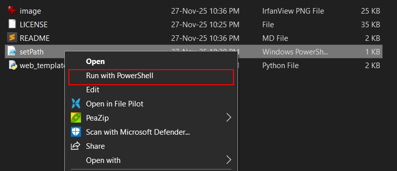

# web-dev-scripts
Create html-css-js files and link them with html boiler plate and css universal rule

## Run directly using curl

```bash
curl -sSL https://raw.githubusercontent.com/ayusht9/web-dev-scripts/main/web_template.py | python
```


## Run it locally

To use this script from anywhere:

1. **Create a folder** to store your utility scripts

   ```bash
   mkdir ~/dev-tools
   ```

   ```cmd
   mkdir %USERPROFILE%\dev-tools
   ```

2. **Move this script** into that folder:

   ```bash
   mv web_template.py ~/dev-tools/
   ```

   ```cmd
   move web_template.py %USERPROFILE%\dev-tools
   ```

3. **Add the folder to your system PATH** so you can run the script globally:

   * On **macOS / Linux**, add this line to your `~/.bashrc`, `~/.zshrc`, or `~/.profile`:

     ```bash
     export PATH="$PATH:~/dev-tools"
     ```

     Then reload your shell:

     ```bash
     source ~/.bashrc
     ```
   * On **Windows**:

     * run setPath.ps1 with powershell

     


4. Now you can run the script from anywhere using:

   ```bash
   web_template.py
   ```
